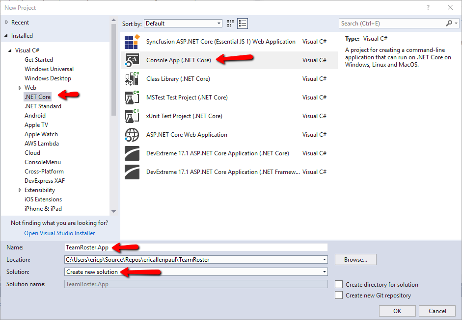
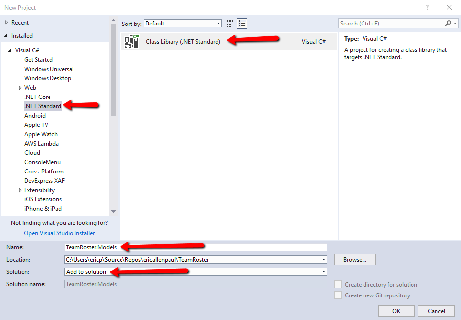
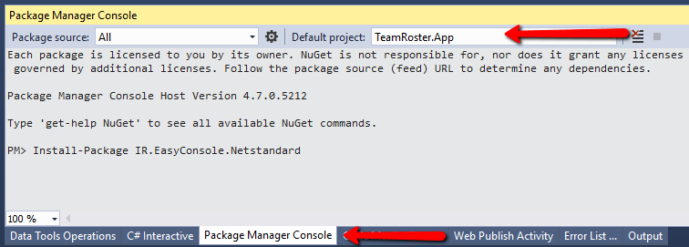
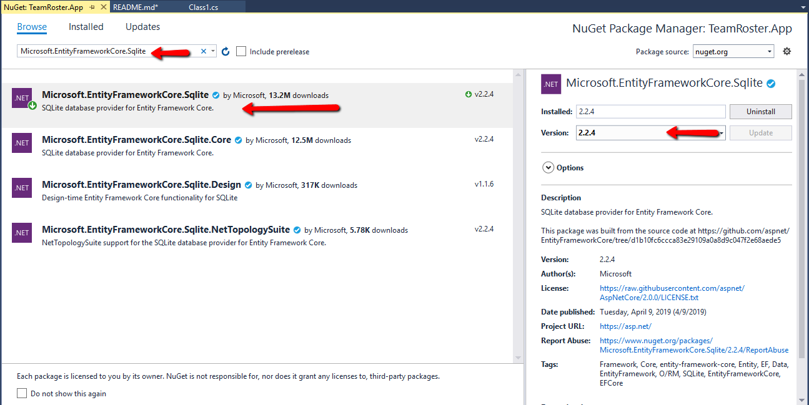

# TeamRoster
A .Net core console app using SQLLite and the EntityFramewrokCore

We started this project by creating a .Net core cosole app named TeamRoster.App 
(These screens may look dfifferent depending on your version of visual studio.)

Then I added another new project this time choosing class library and  

Install EasyConsole

Install-Package IR.EasyConsole.Netstandard 

https://github.com/splttingatms/EasyConsole

add packages
Install-Package Microsoft.EntityFrameworkCore -Version 2.2.4
Install-Package Microsoft.EntityFrameworkCore.Sqlite -Version 2.2.4
Install-Package Microsoft.EntityFrameworkCore.Design -Version 2.2.4

I'm being very specific about the version here to perserve this for the 
future. At some point a newer version of .Net Core may break this application.

You can also right click on the project and add nuget packages via the GUI.

Add Your Models (Class files)
One of the best places to start designing an application that uses a database is your models (or classes). 
It’s a simple task that in the long term can be challenging to master. 
At the simplest level think about how to describe the data you need to collect as nouns. 
In this application, which is designed to keep track of a team roster we have nouns like:

- Team
- Player
- Coach

https://docs.microsoft.com/en-us/ef/core/get-started/netcore/new-db-sqlite
